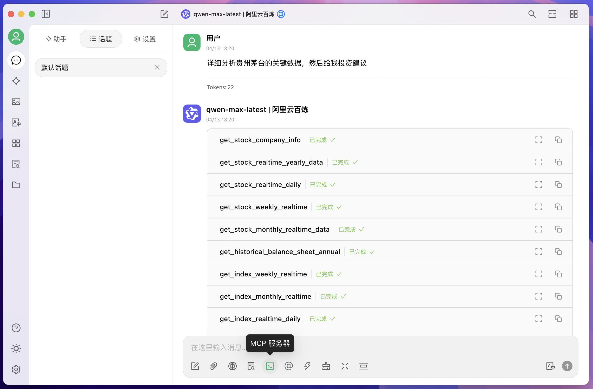
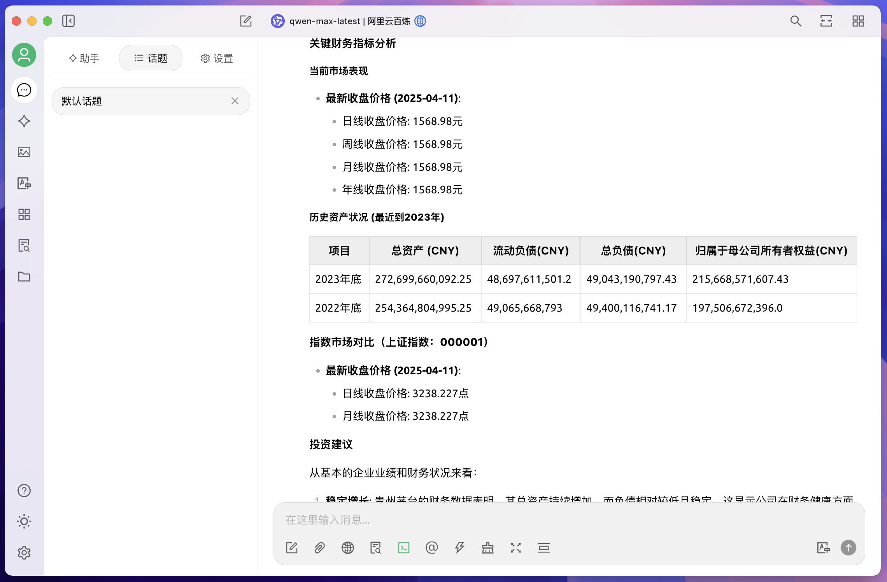
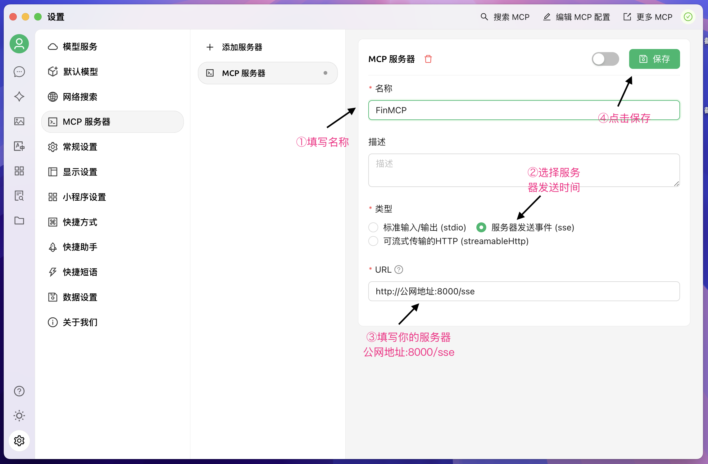
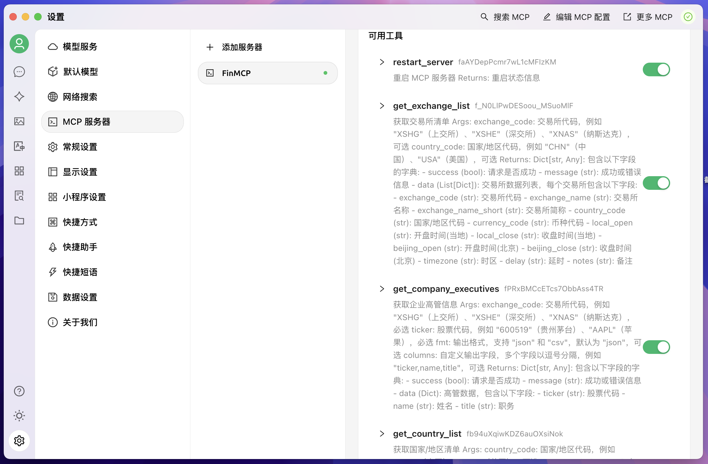

# 📈 FinMCP - 金融多维度分析 LLM 系统

## 🧭 项目简介

**FinMCP** 是一个为金融领域设计的多维度分析 LLM 系统，适合作为 Agent 项目练习和扩展。  
它基于 [沧海数据](https://tsanghi.com) 提供的高质量金融市场 API，包括股票、指数、债券等数据，支持**按量付费**，非常灵活方便。

> ⚠️ 本项目仅包含 MCP 相关服务，LLM 需自行集成。

### ✨ 效果展示

| 问答示例 | 工具面板 |
|---------|---------|
|  |  |

---

## 🧩 核心功能

- 📊 **股票数据查询**：实时行情、历史K线、财务报表、分红配股等  
- 📈 **指数数据查询**：成分股、实时指数、历史走势等  
- 💹 **市场信息**：交易所、股票列表、公司基础资料等  
- 💰 **财务分析**：资产负债表、现金流量表、利润表  
- 🏢 **企业信息**：公司概况、管理层、股东结构等  

---

## ⚡ 快速开始

### 1. 环境搭建

```bash
conda create -n finMCP python=3.11
conda activate finMCP
pip install uv
```

### 2. 克隆项目

```bash
git clone https://github.com/Ryenlvy/FinMCP.git
cd FinMCP
```

### 3. 启动服务

```bash
export FIN_API_TOKEN=your_api_token  # 替换为你在沧海数据获取的 token
bash start_server.sh
```

#### 启动参数说明（可在 `start_server.sh` 中修改）：

- `--transport`：通信方式，支持 `stdio` / `sse` / `fastapi`
- `--host`：绑定地址（如 `0.0.0.0`）
- `--port`：监听端口（默认 8000）

---

## 🖥️ 前端配置（使用 Cherry Studio）

项目推荐搭配 [Cherry Studio](https://docs.cherry-ai.com/cherry-studio/download) 使用：

1. 进入 Cherry Studio，点击 `设置 - MCP服务器`  
2. 参考 [MCP 安装教程](https://docs.cherry-ai.com/advanced-basic/mcp/install) 添加服务  
3. 成功连接后界面如下：

### 配置界面示意：

- 添加服务器：  
  

- 工具展示页面：  
  

---

## 🔧 API 示例代码

### 获取股票实时行情

```python
async def get_stock_realtime_daily(exchange_code: str, ticker: str):
    url = f"https://tsanghi.com/api/fin/stock/{exchange_code}/daily/realtime"
    params = {"token": FIN_API_TOKEN, "ticker": ticker, "fmt": "json"}
    
    async with httpx.AsyncClient() as client:
        response = await client.get(url, params=params)
        return response.json()
```

### 获取公司信息

```python
async def get_stock_company_info(exchange_code: str, ticker: str):
    url = f"https://tsanghi.com/api/fin/stock/{exchange_code}/company/info"
    params = {"token": FIN_API_TOKEN, "exchange_code": exchange_code, "ticker": ticker}
    
    async with httpx.AsyncClient() as client:
        response = await client.get(url, params=params)
        return response.json()
```

---

## 🛠️ 自定义工具函数开发指南

如果你只想搭建本项目，那么以上的内容就足够了，以下内容给出一个流程化tools生成的参考思路：

- `crawl_tsanghi_docs.py`：爬取沧海 API 文档
- `code_creater.py`：基于文档调用 `qwen-max` 自动生成工具函数代码

### 工具生成步骤：

1. 运行 `crawl_tsanghi_docs.py` 爬取所有接口说明，每个功能保存为一个json  
2. 使用 `code_creater.py` 将json和server.py,tools.py一起丢给qwen-max，生成 Python 函数，一个json生成一个函数
3. 最后将生成的函数统一放入 `tools.py` 而server.py 只要 from tools import * 即可，非常的方便快捷、自动化程度很高

---

## 📁 项目结构一览

```
FinMCP/
├── server.py                 # 主服务入口
├── tools.py                  # 所有工具函数汇总
├── crawl_tsanghi_docs.py     # 爬虫脚本（抓取 API 文档）
├── code_creater.py           # 代码生成器（自动创建工具函数）
├── tsanghi_docs/             # 存放爬取的文档
└── tools_code/               # 生成的工具函数代码临时目录
```

---

## 🩺 健康检查与调试接口

- `GET /health`：服务健康状态检查  
- `GET /tools/list`：列出所有已注册的工具函数  
