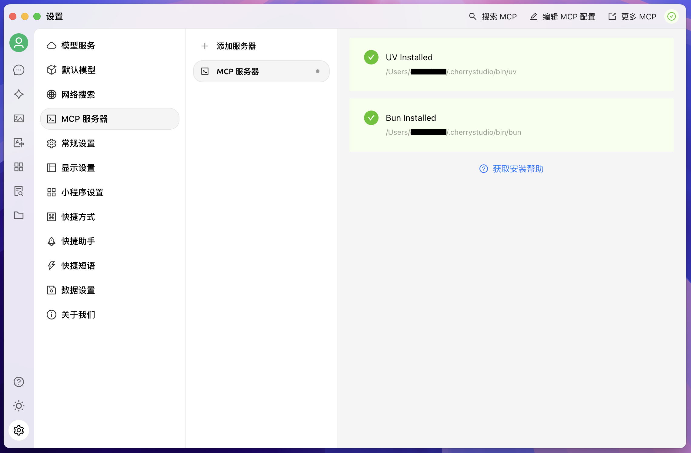

# FinMCP

## 项目概述
这是一个适合多维度分析的金融LLM系统（代码包含MCP，LLM需要自己调用），提供完整的搭建过程

本项目基于：[沧海数据](https://tsanghi.com)是一个专业的金融数据API服务，提供全面的股票、指数、债券等金融市场数据

主要是提供按量付费，比较方便

效果如下


**该项目主要是agent方向一个练手项目，会尽量拓展新功能**

## 核心功能

- **股票数据查询**：实时行情、历史K线、财务报表、分红配股等
- **指数数据查询**：成分股、实时指数、历史走势等
- **市场数据**：交易所信息、股票列表、公司信息等
- **财务数据**：资产负债表、现金流量表、利润表等
- **企业信息**：公司概况、股东结构、管理层信息等

## 快速开始

### 环境配置

```bash
conda create -n finMCP python=3.11

conda activate finMCP

pip install uv
```
### 服务器配置

```bash
git clone https://github.com/Ryenlvy/FinMCP.git

cd FinMCP
```

### 启动

```bash
export FIN_API_TOKEN=your_api_token
#填写沧海数据的api key

bash start_server.sh
```

#### 服务器启动选项
在start_server.sh中，可以修改启动选项
- `--transport`：传输模式，支持`stdio`、`sse`或`fastapi`
- `--host`：服务器绑定的主机地址
- `--port`：服务器监听的端口

### 前端配置
本项目使用Cherry Studio，可以参考[Cherry Studio安装文档](https://docs.cherry-ai.com/cherry-studio/download)

首先点击到`设置-MCP服务器`，右上角环境缺失 [教程连接](hhttps://docs.cherry-ai.com/advanced-basic/mcp/install)，成功后如下页面



### 配置MCP服务器

添加一个服务器


正常配置后会如下页面,包含所有tools


## API示例
### 获取股票实时行情

```python
async def get_stock_realtime_daily(exchange_code: str, ticker: str):
    """获取股票实时日线数据"""
    url = f"https://tsanghi.com/api/fin/stock/{exchange_code}/daily/realtime"
    params = {
        "token": FIN_API_TOKEN,
        "ticker": ticker,
        "fmt": "json"
    }
    
    async with httpx.AsyncClient() as client:
        response = await client.get(url, params=params)
        return response.json()
```

### 获取公司信息

```python
async def get_stock_company_info(exchange_code: str, ticker: str):
    """获取股票公司信息"""
    url = f"https://tsanghi.com/api/fin/stock/{exchange_code}/company/info"
    params = {
        "token": FIN_API_TOKEN,
        "exchange_code": exchange_code,
        "ticker": ticker
    }
    
    async with httpx.AsyncClient() as client:
        response = await client.get(url, params=params)
        return response.json()
```

## 文档爬虫 & 工具生成
如果只是为了使用该FinMCP，以上就足够了，如果想要自己编写tools，可以参考以下内容

因为沧海数据主要是使用request库直接调用，并没有专门的Python SDK，因此我选择一个方便、自动化的方法来操作和编写tools,包含以下两个文件

- `crawl_tsanghi_docs.py`：爬取沧海API文档
- `code_creater.py`：基于文档自动生成工具函数代码

使用`code_creater.py` 调用qwen-max模型生成工具函数，最后一起复制到`tools.py`中

最后tools.py中包含所有工具函数（文档里有的就有）
## 项目结构

```
├── server.py           # 主服务器实现
├── tools.py            # 工具函数集合
├── crawl_tsanghi_docs.py  # API文档爬虫
├── code_creater.py     # 代码生成器
├── tsanghi_docs/       # 爬取的文档存储目录
└── tools_code/         # 生成的工具函数代码
```

## 健康检查与调试

- `/health`：健康检查端点
- `/tools/list`：列出所有可用工具函数

